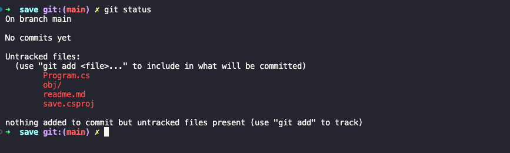
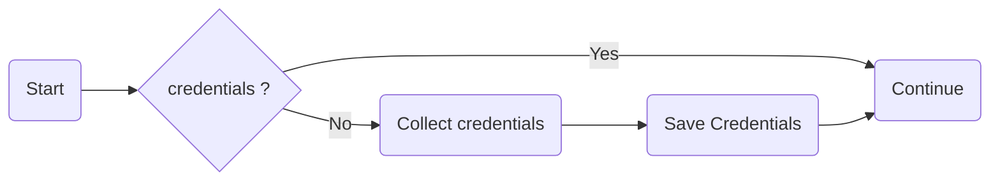
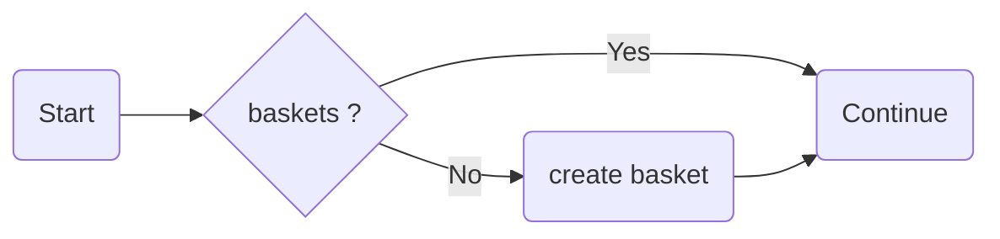
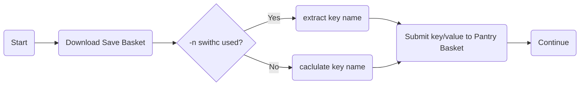

# Pantry workshop

The point of this workshop is to get more experiance working with third party services and creating usefull tools. 
When you have completed this workshop you should have a new tool caled Save, this tool will alowe you to save arbetrary notes to a temporary cloude storage called Pantry.
Pantry is free, but have some limitations (read about them at https://getpantry.cloud/).

As always we focus on readability and maintainability of code.  
You should not use any third party librarise or LINQ in this project, we want to emphasise the core skills.

## Stepp 1: Setup your enviorment

These are the stepps we take in order to have a productive experiance and work towards a successfull outcome. 

- [ ] In your work-folder (where you usualy save your ongoing work), create the folder `Save` 
- [ ] Initialize `git` in the `Save` folder
   - Navigate into the `Save` folder using the `cd` command if you are in a terminal
   - Initalize a git repository in the save foldern (`git init`)
- [ ] Run the command `dotnet new console -n save -o .`  
The `-n` option is the name given to the project.   
The `-o` option followd by `.` spescifies that the porject is created in the current folder.
- [ ] Open the `Save` folder in **VS.Code**
- [ ] Delete the contens of the file `Program.cs`
- [ ] Create the file readme.md

**❗️ Save your work**
- [ ] Run the command `git status`and confim that there are no suprizes  
This is a typicaly what you would expect to see:  
   
- [ ] If evrything looks ok, run the command `git add --all` and the command `git commit -m "Project Scafold"`

Remember that this is just a local save point. If you want a redundant backup, you must create a repostiory on forinstance GitHub.

## Stepp 2: Create Pantry account

This stepp is about getting an account and credentials for the service Pantry.   
Pantry is a service for developers that are working on projects that need a temporary storage (instead of having to setup databases, file stores etc).  
The key part to remeber is that it is temprary. 

**Things to keep in mind:**
* You can only have one pantry per email address (you only need one for this workshop)
* If you are using Gmail you can use the plus [("+") sign trick](https://gmail.googleblog.com/2008/03/2-hidden-ways-to-get-more-from-your.html)  
* The data in a pantry is deleted 30 days after last time it was interacted with. 

- [ ] Go to https://getpantry.cloud/ and input the emnail address that you want to associate with the pantry.
- [ ] Give your pantry a name 
- [ ] Save your pantry id in a place you will not loose it, it will also be emaild to you
- [ ] Have a look around on the pantry website, look at your pantry, get familiar with what a basket is, use the online dashboard to make changes. 

## Stepp 3: Store Credentials. 

We do not want to hardcode our credentials into the app. Instead the app should ask for credentilas if no credentials exists. if there are credentials the app should just continue. 

- [ ] We are going to save our credentials in a file named `.config` so checking for credentials is going to entail trying to read this file. The first time (or if somone deletes the file) it will faile and we should ask for credentials and the save it to `.config`.
   -  Using [`File.ReadAllLines`](https://learn.microsoft.com/en-us/dotnet/api/system.io.file.readalllines?view=net-8.0) try to read the file.
   -  Using [`File.Exist`](https://learn.microsoft.com/en-us/dotnet/api/system.io.file.exists?view=net-8.0) can be a way of avoiding reading a file that dos not exists.
   -  If there is no credentials we should ask for the pantry id
   -  Save the panty id to `.config` using [`File.WriteAllText`](https://learn.microsoft.com/en-us/dotnet/api/system.io.file.writealllines?view=net-8.0)

At this point regardles of the path the user took through the flowchart we know have the credentials available to us.   
It is now time to refactor, make our code more readable and maintainable. We might also consider adding features like setting a credential with a parameter (save --id KEY-FROM-PANTRY), this will not make the code better, but a wast improvment for the usability of our app. Consider allso where the file should be saved, it is customary to save config files in cirtain folders in the users private structure.

Remember to test that your credentials are being saved and retrived.

**❗️ Save your work**
- [ ] Run the command `git status`and confim that there are no suprizes  
- [ ] If evrything looks ok, run the command `git add --all` and the command `git commit -m "Pantry ID acquisition an storage."`

Remember that this is just a local save point. If you want a redundant backup, you must create a repostiory on forinstance GitHub.

## Steppp 4: Pantry phone home 

It is time to comunicate whit the Pantry API, specificaly we are going to get the listing of baskets from pantry.
If there is no baskets we are going to create a `save` basket. To achive this there is two api calls we must do [Pantry Get details](https://documenter.getpostman.com/view/3281832/SzmZeMLC#a239b693-9df6-4757-9291-91cd8b73c714) and [Create basket](https://documenter.getpostman.com/view/3281832/SzmZeMLC#98b35ee9-9d11-417e-8739-21a4ac9893ed)

- [ ] Using the HttpClient do a Get request to the [Pantry Get details](https://documenter.getpostman.com/view/3281832/SzmZeMLC#a239b693-9df6-4757-9291-91cd8b73c714) API endpoint. Not that the PANTRY API requiers you to have the header `Content-type` set to `application/json`, also your url endpoint should end in a `/`
- [ ] Using [JSON Serialize](https://learn.microsoft.com/en-us/dotnet/standard/serialization/system-text-json/how-to) extract the information recived from Pantry. (This might be a good time for som classes)
- [ ] If there is a basket with the name `save`, continue.
- [ ] else create a basket with the name `save`
- [ ] Run the application
- [ ] Go to the dashboard at Pantry and confirme that there now is a basket with the name save

This is the point we need to start thinking about error handling. Calling a remote API might fail for multiple reasons.

**❗️ Save your work**
- [ ] Run the command `git status`and confim that there are no suprizes  
- [ ] If evrything looks ok, run the command `git add --all` and the command `git commit -m "Basket verified or created."`

Remember that this is just a local save point. If you want a redundant backup, you must create a repostiory on forinstance GitHub.

## Stepp 5: Saving 

At this point we have contact with Pantry, and we have a basket to save our notes to.
So it is time to do so. The user should be able to set the key for the note using `-n` followd by the key name. If there is no parameter we should asume that all innputs are part of the note to save. 

Once we have the key and values, we are going to use the [Update Content](https://documenter.getpostman.com/view/3281832/SzmZeMLC#f1c2c2b2-63d3-42f6-b30d-94b08ed68ca9) API call. This call will merge our new key with existing eksy and overwrit if there is allready a key with the same name.

- [ ] Download basket data.
- [ ] Determin if there is a key parameter (-n)
- [ ] If there is no key parameter, generate a key name based on existing keys and a rule.
- [ ] Send the data to Pantry
- [ ] If there was no input, display the content of the basket

**❗️ Save your work**
- [ ] Run the command `git status`and confim that there are no suprizes  
- [ ] If evrything looks ok, run the command `git add --all` and the command `git commit -m "Save key value to basket with optional key naming switch"`

Remember that this is just a local save point. If you want a redundant backup, you must create a repostiory on forinstance GitHub.